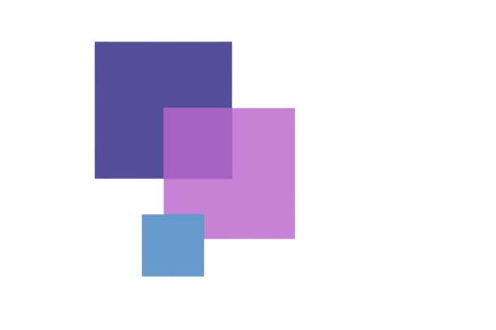
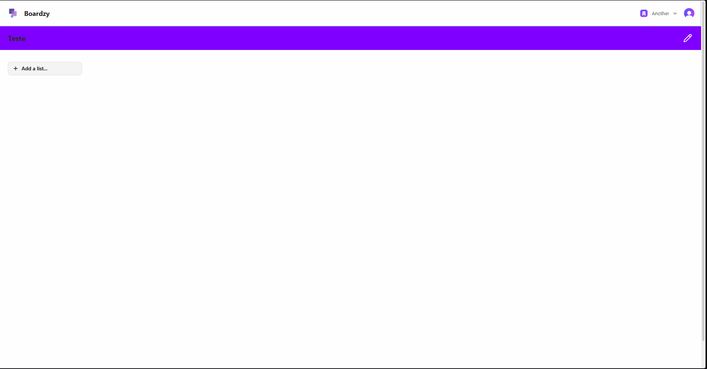

#  Boardzy

<div align="center ">

<div>


</div>

###

<div>


</div>

###



</div>

## Description

Boardzy is a project management application inspired by the Kanban and Trello methods, helping users and teams organize their tasks in a visual, simple, and intuitive way. With customizable boards, lists, and dynamic cards, it’s possible to plan, track, and prioritize tasks in real time, making collaboration more efficient and transparent.

<div align="left">

## Boardzy Features

### 📁 Board Management

<ul>
    <li>Create, edit, and delete custom boards.</li>
    <li>Visual organization through columns and cards.</li>
    <li>Support for multiple boards to manage different projects.</li>
</ul>

### 📝 List Management

<ul>
    <li>Create lists within each board (e.g., To Do, In Progress, Done).</li>
    <li>Rename and delete lists.</li>
    <li>Reorder lists using drag & drop.</li>
</ul>

### 🗂️ Card Management

<ul>
    <li>Create, edit, and delete cards with titles and descriptions.</li>
    <li>Move cards between lists using drag & drop.</li>
</ul>

### 🔐 User Authentication

<ul>
    <li>Sign up and log in using Clerk authentication.</li>
    <li>Manage user profiles and preferences.</li>
    <li>Protected routes to prevent unauthorized access.</li>
</ul>

### 👥 Real-Time collaboration

<ul>
<li>Add members to boards</li>
<li>Role-based permissions (admin / member )</li>
<li>Instant synchronization of changes for all users</li>
</ul>

### 🎨 Customization

<ul>
<li>Board color themes</li>
<li>User avatars </li>
<li>Custom name and description for each board</li>
</ul>

### 📱 Responsive Design

<ul>
<li>Fully responsive layout for desktop, tablet, and mobile/li>
<li>Touch-friendly interactions for mobile devices</li>

</ul>

</div>

## 🚀 Installation

### Front-end

```bash

1. Clone the repository https://github.com/renan22Rsw/Boardzy.git

2. `cd` into `front-end` folder

3. Run `npm install` or `yarn install`

4. Run `npm run dev` or `yarn dev` to start the frontend development server

```

### Back-end

```bash

1. Clone the repository https://github.com/renan22Rsw/Boardzy.git

2. `cd` into `back-end` folder

3. Run `npm install` or `yarn install`

4. Run `npm run dev` or `yarn dev` to start the backend development server

Make sure you have the correct environment variables set in your `.env` file in the root of the project. You can copy the `.env.example` file and rename it to `.env`.

```
